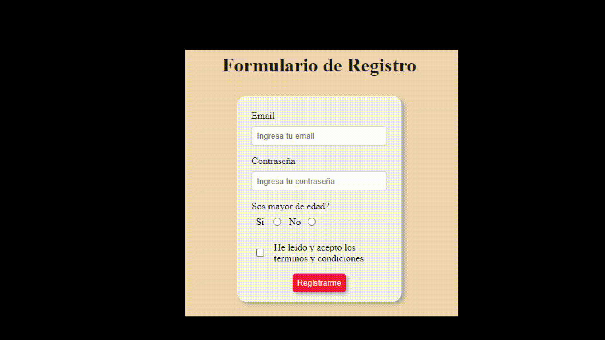
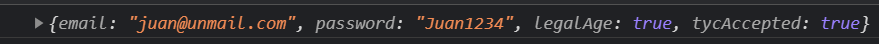

# Ejercicio de Práctica. ✏️

En el presente ejercicio, partiremos de un formulario de registro previamente implementado, en donde el usuario ingresará una serie de datos a partir de los inputs correspondientes.

La consigna del ejercicio, consiste en recuperar cada uno de dichos valores utilizando los métodos que Javascript nos provee para ello, para poder realizar algunas validaciones y mostrar el resultado esperado, tal y como se explica en cada uno de los pasos que se encuentran en el archivo index.js dentro de la carpeta scripts.js. ✔️

Para ello, deberás examinar y prestar atención a los distintos tags html y sus distintas propiedades, para ver de que manera puedes seleccionar cada elemento mediante javascript. 👀 👀 👀

Para resolver este ejercicio, deberás escribir tu código en el archivo index.js que se encuentra dentro de la carpeta ```scripts```

## Ejemplo:

Al completar el form de la siguiente manera:



Se deberá obtener el siguiente resultado:



A programar! 💻
